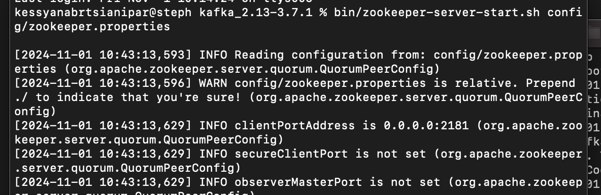
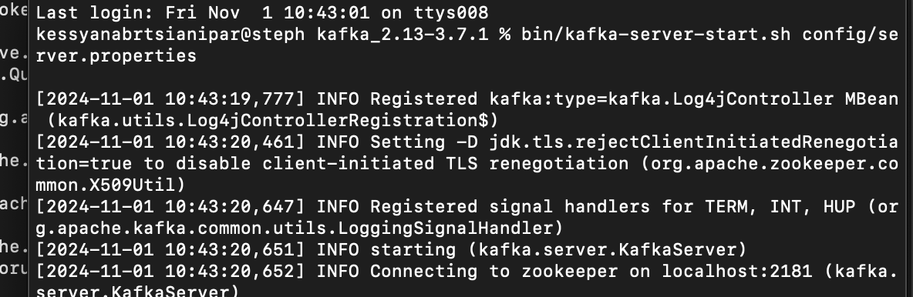
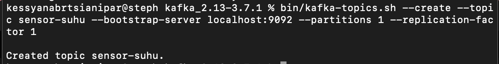

# Simple-Kafka-Spark-Project

| Nama                            | NRP        |
|---------------------------------|------------|
| Azzahra Sekar Rahmadina         | 5027221035 |
| Stephanie Hebrina Mabunbun Simatupang | 5027221069 |

Proyek ini adalah contoh sederhana untuk menjalankan Apache Kafka dengan integrasi Spark. Proyek ini mencakup konfigurasi Kafka dan Zookeeper untuk menjalankan instance Kafka yang dapat diakses lokal untuk kebutuhan pengembangan.

## Step-by-step Setup
1. **Install JDK**  
   Pastikan JDK telah terinstal untuk menjalankan Kafka dan Spark.

2. **Download Kafka (Binary 2.13-3.8.1)**
   ```bash
   wget https://downloads.apache.org/kafka/3.8.1/kafka_2.13-3.8.1.tgz
   ```

3. **Extract Kafka**
   ```bash
   tar -xzf kafka_2.13-3.8.1.tgz
   ```

4. **Navigate to Kafka Directory**
   ```bash
   cd kafka_2.13-3.8.1
   ```

5. **Start Zookeeper**
   ```bash
   bin/zookeeper-server-start.sh config/zookeeper.properties
   ```





6. **Start Kafka Server**  
   Open a new terminal, navigate to the Kafka directory, and start the Kafka server:
   ```bash
   bin/kafka-server-start.sh config/server.properties
   ```


   

7. **Create a Kafka Topic (sensor-suhu)**
   ```bash
   bin/kafka-topics.sh --create --topic sensor-suhu --bootstrap-server localhost:9092 --partitions 1 --replication-factor 1
   ```


   

8. **Install Kafka-Python Library**
   ```bash
   pip install kafka-python
   ```

9. **Download Apache Spark**
   ```bash
   wget https://dlcdn.apache.org/spark/spark-3.5.3/spark-3.5.3-bin-hadoop3.tgz
   ```

10. **Extract and Move Spark to /opt Directory**
    ```bash
    tar -xzf spark-3.5.3-bin-hadoop3.tgz
    sudo mv spark-3.5.3-bin-hadoop3 /opt/spark
    ```

11. **Set SPARK_HOME Environment Variable**
    ```bash
    echo 'export SPARK_HOME=/opt/spark' >> ~/.bashrc
    echo 'export PATH=$SPARK_HOME/bin:$PATH' >> ~/.bashrc
    source ~/.bashrc
    ```

12. **Verify Spark Installation**
    ```bash
    spark-submit --version
    ```

## Kode Python untuk Producer dan Consumer

Pastikan telah menginstal `kafka-python` sebelum melanjutkan.

- **Menginstal Kafka Python**
  ```bash
  pip install kafka-python
  ```

- **Membuat topik sensor-suhu**
  ```bash
  bin/kafka-topics.sh --create --topic sensor-suhu --bootstrap-server localhost:9092 --partitions 1 --replication-factor 1
  ```

### Menjalankan Producer dan Consumer

1. **Jalankan producer di terminal baru:**
   ```bash
   python producer.py
   ```

2. **Jalankan consumer di terminal baru:**
   ```$SPARK_HOME/bin/spark-submit --packages org.apache.spark:spark-sql-kafka-0-10_2.12:3.1.1 /Users/kessyanabrtsianipar/Documents/Collage/5th/big\ data/sensor-suhu/consumer.py```

## Hasil
